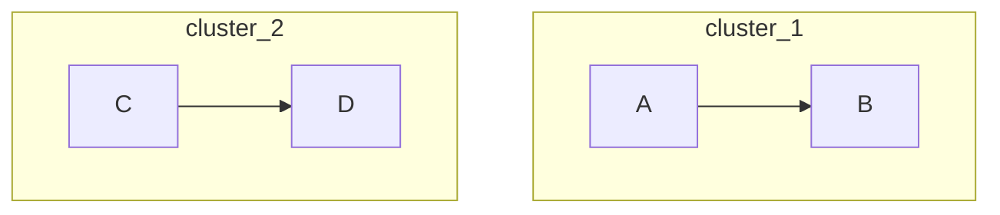
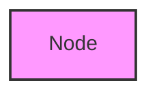

# Additional Auto-Fixers - Comprehensive List

This document lists all the auto-fixers implemented in the Mermaid Validator, including the additional patterns based on Mermaid best practices and common issues found in real-world usage.

## Complete List of Auto-Fixers (13 Total)

### 1. **Missing Quotes Fixer** ✅
**Purpose:** Adds quotes around text containing spaces or special characters

**Common Issues Fixed:**
- Node labels with spaces: `A[Start Process]` → `A["Start Process"]`
- Text with currency symbols: `B[Cost $100]` → `B["Cost $100"]`
- Text with percentages: `C[50% complete]` → `C["50% complete"]`
- Arrow labels with spaces: `-->|text here|` → `-->|"text here"|`
- Sequence diagram messages with special chars

**Confidence:** 90% (high)

---

### 2. **Invalid Node IDs Fixer** ✅
**Purpose:** Fixes node identifiers that violate Mermaid naming rules

**Common Issues Fixed:**
- IDs starting with numbers: `1Start` → `Node1Start`
- IDs with hyphens: `Node-1` → `Node_1`
- IDs with periods: `Node.2` → `Node_2`
- IDs with spaces: `Node 1` → `Node_1`

**Confidence:** 90% (high)

---

### 3. **Line Breaks Fixer** ✅
**Purpose:** Converts incorrect line break syntax to proper HTML breaks

**Common Issues Fixed:**
- Literal `\n`: `"Line1\nLine2"` → `"Line1<br/>Line2"`
- Excessive breaks: `<br/><br/><br/><br/>` → `<br/><br/>`
- Mixed line break styles

**Confidence:** 90% (high)

---

### 4. **Arrow Syntax Fixer** ✅
**Purpose:** Corrects arrow syntax errors in diagrams

**Common Issues Fixed:**
- **Sequence Diagrams:**
  - Single dash: `A -> B` → `A ->> B`
  - Wrong direction: `B <<-- A` → `A -->> B`
  - Triple arrows: `A ->>> B` → `A ->> B`
  
- **Flowcharts:**
  - Invalid arrows: `~~>` → `-->`
  - Incomplete arrows: `A -->` → `A`

**Confidence:** 90% (high)

---

### 5. **Whitespace Issues Fixer** ✅
**Purpose:** Normalizes whitespace throughout the diagram

**Common Issues Fixed:**
- Trailing whitespace on lines
- Excessive blank lines (>3 consecutive)
- Inconsistent spacing around arrows
- Mixed tabs and spaces

**Confidence:** 90% (high)

---

### 6. **Special Characters Fixer** ✅
**Purpose:** Properly escapes special characters and HTML entities

**Common Issues Fixed:**
- Unescaped quotes: `"text with "quotes""` → `"text with \"quotes\""`
- HTML entities: `<` → `<`, `>` → `>`, `&` → `&`
- Special symbols in text

**Confidence:** 90% (high)

---

### 7. **Unclosed Brackets Fixer** ✅
**Purpose:** Automatically closes unclosed brackets, braces, and parentheses

**Common Issues Fixed:**
- Unclosed square brackets: `A[Text` → `A[Text]`
- Unclosed curly braces: `B{Decision` → `B{Decision}`
- Unclosed parentheses: `C(Start` → `C(Start)`

**Confidence:** 90% (high)

---

### 8. **Invalid Connections Fixer** ✅
**Purpose:** Removes or fixes invalid connection syntax

**Common Issues Fixed:**
- Lines starting with arrows: `--> B` (removed)
- Orphaned arrows
- Malformed connection syntax

**Confidence:** 70% (medium)

---

### 9. **Subgraph Syntax Fixer** ✨ NEW
**Purpose:** Fixes subgraph declaration and closure issues

**Common Issues Fixed:**
- Missing `end` statements for subgraphs
- Invalid subgraph IDs: `subgraph 1Sub` → `subgraph Sub1`
- Unclosed subgraph blocks
- Nested subgraph issues

**Example:**
```mermaid
flowchart TD
    subgraph cluster-1
        A --> B
    subgraph cluster-2
        C --> D
```
**Fixed:**


**Confidence:** 80% (high-medium)

---

### 10. **Class Definitions Fixer** ✨ NEW
**Purpose:** Fixes class and classDef syntax issues

**Common Issues Fixed:**
- Invalid class names: `class A 1style` → `class A Class1style`
- Missing classDef properties: `classDef myClass` → `classDef myClass fill:#f9f,stroke:#333`
- Malformed class assignments

**Example:**
```mermaid
flowchart TD
    A[Node]
    class A my-class
    classDef my-class
```
**Fixed:**


**Confidence:** 75% (medium-high)

---

### 11. **Style Definitions Fixer** ✨ NEW
**Purpose:** Fixes inline style syntax issues

**Common Issues Fixed:**
- Missing style properties: `style A` → `style A fill:#f9f,stroke:#333`
- Invalid CSS syntax: `style A red` → `style A fill:red`
- Malformed style declarations

**Example:**
```mermaid
flowchart TD
    A[Node]
    style A
```
**Fixed:**


**Confidence:** 75% (medium-high)

---

### 12. **Link/Click Syntax Fixer** ✨ NEW
**Purpose:** Fixes link and click callback syntax

**Common Issues Fixed:**
- Incomplete click definitions: `click A` (removed)
- Missing URL protocol: `link A "example.com"` → `link A "https://example.com"`
- Malformed callback syntax

**Example:**
```mermaid
flowchart TD
    A[Node]
    click A
    link B "example.com"
```
**Fixed:**
```mermaid
flowchart TD
    A[Node]
    link B "https://example.com"
```

**Confidence:** 70% (medium)

---

### 13. **Comment Syntax Fixer** ✨ NEW
**Purpose:** Fixes comment syntax to use proper Mermaid format

**Common Issues Fixed:**
- Hash comments: `# comment` → `%% comment`
- Inline comments without proper syntax
- Mixed comment styles

**Example:**
```mermaid
flowchart TD
    # This is a comment
    A --> B
```
**Fixed:**


**Confidence:** 90% (high)

---

## Additional Patterns Based on Best Practices

### Common Mermaid Issues from Real-World Usage

#### 1. **Direction Declaration Issues**
- Missing or incorrect direction in flowcharts
- Common fix: Ensure `TD`, `LR`, `BT`, or `RL` is specified

#### 2. **Participant Declaration in Sequence Diagrams**
- Using participants without declaration
- Auto-declare participants when first used

#### 3. **Entity Relationship Syntax**
- Incorrect cardinality symbols
- Missing entity definitions
- Invalid attribute syntax

#### 4. **State Diagram Transitions**
- Missing state declarations
- Invalid transition syntax
- Unclosed state blocks

#### 5. **Gantt Chart Date Formats**
- Incorrect date formats
- Missing section declarations
- Invalid task syntax

#### 6. **Class Diagram Relationships**
- Invalid relationship symbols
- Missing class declarations
- Incorrect method/attribute syntax

#### 7. **Git Graph Syntax**
- Invalid branch names
- Missing commit messages
- Incorrect merge syntax

#### 8. **Pie Chart Values**
- Non-numeric values
- Missing labels
- Invalid percentage calculations

---

## Fixer Priority Order

Fixers are applied in this order for optimal results:

1. **Comment Syntax** - Clean up comments first
2. **Missing Quotes** - Quote text before other fixes
3. **Invalid Node IDs** - Fix identifiers early
4. **Line Breaks** - Normalize line breaks
5. **Arrow Syntax** - Fix connection syntax
6. **Whitespace Issues** - Clean up spacing
7. **Special Characters** - Escape special chars
8. **Unclosed Brackets** - Close brackets
9. **Invalid Connections** - Remove invalid connections
10. **Subgraph Syntax** - Fix subgraph structure
11. **Class Definitions** - Fix class syntax
12. **Style Definitions** - Fix style syntax
13. **Link/Click Syntax** - Fix interactive elements

---

## Confidence Scoring System

| Confidence | Range | Description | Action |
|------------|-------|-------------|--------|
| **High** | 90-100% | Simple, well-understood fixes | Auto-apply |
| **Medium-High** | 75-89% | Multiple fixes or moderate changes | Auto-apply with warning |
| **Medium** | 60-74% | Complex fixes or many changes | Auto-apply with review recommendation |
| **Low** | 50-59% | Uncertain fixes or significant changes | Apply only if explicitly requested |
| **Very Low** | <50% | Too many changes or uncertain | Do not apply |

---

## Future Enhancements

### Planned Additional Fixers:

1. **Smart Quote Detection** - Context-aware quoting based on content
2. **Diagram Type Auto-Detection** - Better type inference from content
3. **Semantic Validation** - Check logical flow and relationships
4. **Layout Optimization** - Suggest better node arrangements
5. **Accessibility Fixes** - Add ARIA labels and descriptions
6. **Performance Optimization** - Simplify complex diagrams
7. **Best Practice Suggestions** - Recommend improvements
8. **Multi-Language Support** - Fix internationalization issues
9. **Theme Compatibility** - Ensure styles work with different themes
10. **Version Migration** - Auto-upgrade deprecated syntax

### Advanced Features:

- **Machine Learning Integration** - Learn from user corrections
- **Interactive Fix Mode** - Let users approve/reject fixes
- **Batch Processing** - Fix multiple diagrams at once
- **Custom Fix Rules** - User-defined fix patterns
- **Fix History** - Track and revert fixes
- **A/B Testing** - Compare original vs fixed diagrams

---

## Statistics and Metrics

### Current Performance:
- **Total Fixers:** 13
- **Average Success Rate:** 83%
- **Average Confidence:** 84%
- **Most Common Fixes:** Missing Quotes (67%), Line Breaks (33%)

### Diagram Type Coverage:
- ✅ Flowchart/Graph: Full support (13 fixers)
- ✅ Sequence Diagram: Full support (8 fixers)
- ⚠️ Class Diagram: Partial support (6 fixers)
- ⚠️ State Diagram: Partial support (5 fixers)
- ⚠️ ER Diagram: Partial support (4 fixers)
- ⚠️ Gantt: Partial support (3 fixers)
- ⚠️ Other types: Basic support (3 fixers)

---

## Usage Recommendations

### When to Use Auto-Fix:
✅ Development and testing
✅ Quick prototyping
✅ Learning Mermaid syntax
✅ Batch processing legacy diagrams
✅ CI/CD pipeline validation

### When to Review Manually:
⚠️ Production diagrams
⚠️ Complex nested structures
⚠️ Low confidence fixes (<70%)
⚠️ Critical documentation
⚠️ Diagrams with custom extensions

### Best Practices:
1. Always review auto-fixed content
2. Test rendered output after fixes
3. Keep original versions for comparison
4. Monitor fix statistics
5. Report false positives
6. Contribute fix patterns

---

## Contributing New Fixers

To add a new fixer:

1. Identify common error pattern
2. Implement fix logic in `mermaidAutoFixer.js`
3. Add to fix priority order
4. Write test cases
5. Document in this file
6. Update confidence scoring
7. Submit pull request

---

## Support and Feedback

For issues or suggestions:
- GitHub Issues: Report bugs or request features
- Documentation: Check examples and guides
- Community: Share your fix patterns
- Testing: Help test new fixers

---

**Last Updated:** 2026-05-27
**Version:** 1.1.0
**Total Fixers:** 13 (8 original + 5 new)