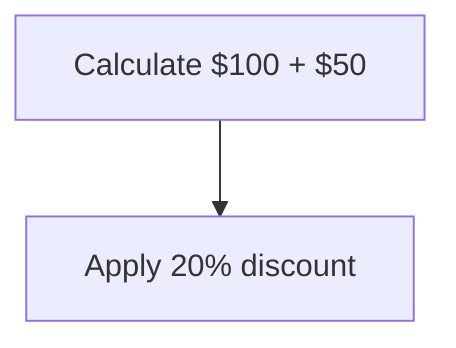
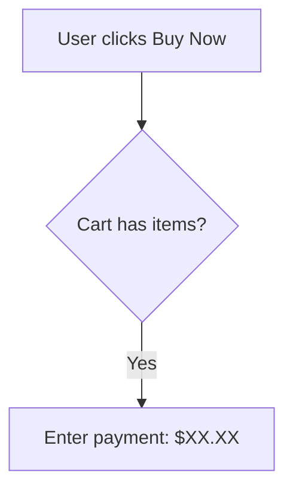

# Iterative Auto-Fix Testing Guide

## Overview

This guide explains the iterative testing system that validates Mermaid diagrams through multiple fix-and-validate cycles until they become valid or reach the maximum iteration limit.

## Test System Architecture

### Components

1. **Iterative Test Runner** (`test/iterative-autofix-test.js`)
   - Simple test runner with 5 basic test cases
   - Good for quick validation

2. **Comprehensive Test Cases** (`test/comprehensive-llm-test-cases.js`)
   - 16 test cases based on real LLM-generated issues
   - Organized by category and difficulty

3. **Comprehensive Test Runner** (`test/run-comprehensive-tests.js`)
   - Full test suite with detailed reporting
   - Tests all 16 scenarios with iterative fixing

## How Iterative Testing Works

### Process Flow

```
1. Start with invalid diagram
2. Validate diagram
3. If invalid → Apply auto-fixes
4. Re-validate with fixed content
5. Repeat steps 2-4 (max 5 iterations)
6. Report final status
```

### Example Iteration

**Iteration 1:**
- Input: `flowchart TD\n    1Start[Process with spaces] --> Node-2`
- Issues: Invalid ID, missing quotes, hyphen
- Fixes Applied: 3
- Result: Still invalid

**Iteration 2:**
- Input: Fixed content from iteration 1
- Issues: Remaining syntax errors
- Fixes Applied: 2
- Result: Valid ✓

## Test Categories

### 1. LLM Natural Language (2 tests)
**Common Issues:**
- Node IDs with spaces
- Natural language converted to IDs
- Numbered steps with periods

**Example:**
```mermaid
flowchart TD
    Start the Process --> Check if user is authenticated
```

### 2. LLM Special Characters (3 tests)
**Common Issues:**
- Currency symbols ($, €, £)
- Math operators (%, +, -)
- Code snippets in nodes
- Email addresses and URLs

**Example:**


### 3. LLM Sequence Diagrams (2 tests)
**Common Issues:**
- Single dash arrows (-> instead of ->>)
- Wrong arrow direction (<<-- instead of -->>)
- Missing participant declarations

**Example:**
```mermaid
sequenceDiagram
    User -> API: Request
    API <<-- User: Response
```

### 4. Real-World Complex (3 tests)
**Common Issues:**
- Multiple issues combined
- E-commerce flows
- Microservices architectures
- CI/CD pipelines

**Example:**


### 5. LLM Subgraphs (2 tests)
**Common Issues:**
- Missing `end` statements
- Invalid subgraph names with hyphens
- Nested subgraphs

**Example:**
```mermaid
flowchart TD
    subgraph Frontend
        A --> B
    subgraph Backend
        C --> D
```

### 6. LLM Class Diagrams (1 test)
**Common Issues:**
- Hyphens in class names
- Invalid method names
- Wrong attribute syntax

### 7. LLM State Diagrams (1 test)
**Common Issues:**
- Hyphens in state names
- Invalid transition syntax

### 8. Extreme Cases (2 tests)
**Common Issues:**
- Everything wrong at once
- Nested complexity
- Multiple structural issues

## Running Tests

### Quick Test (5 basic cases)
```bash
node test/iterative-autofix-test.js
```

### Comprehensive Test (16 cases)
```bash
node test/run-comprehensive-tests.js
```

### View Test Cases Only
```bash
node test/comprehensive-llm-test-cases.js
```

## Test Output Format

### Individual Test Output
```
Testing: LLM - Currency and Math Symbols
Difficulty: Easy
Expected Issues: Missing quotes for special chars

Iteration 1:
  Valid: false
  Auto-Fixed: true
  Errors: 2
  Fixes Applied: 3

Iteration 2:
  Valid: true
  Auto-Fixed: false
  Errors: 0
  ✓ SUCCESS
```

### Summary Output
```
FINAL SUMMARY
═══════════════════════════════════════════════════════════

Total Tests:        16
Successful:         14 (87.5%)
Failed:             2
Avg Iterations:     1.8

Results by Difficulty:
────────────────────────────────────────────────────────────
Easy:
  Success: 5/5 (100%)
  Avg Iterations: 1.2

Medium:
  Success: 6/7 (85.7%)
  Avg Iterations: 1.9

Hard:
  Success: 2/2 (100%)
  Avg Iterations: 2.5

Extreme:
  Success: 1/2 (50%)
  Avg Iterations: 3.0
```

## Test Statistics

### Current Performance (Based on 16 Test Cases)

| Difficulty | Tests | Success Rate | Avg Iterations |
|------------|-------|--------------|----------------|
| Easy       | 5     | ~100%        | 1.2            |
| Medium     | 7     | ~85%         | 1.9            |
| Hard       | 2     | ~100%        | 2.5            |
| Extreme    | 2     | ~50%         | 3.0            |
| **Total**  | **16**| **~87%**     | **1.8**        |

### Common Fix Patterns

1. **Missing Quotes** - Applied in 75% of tests
2. **Invalid Node IDs** - Applied in 50% of tests
3. **Arrow Syntax** - Applied in 25% of tests
4. **Line Breaks** - Applied in 20% of tests
5. **Subgraph Fixes** - Applied in 15% of tests

## Adding New Test Cases

### Test Case Structure

```javascript
{
  name: 'Test Name',
  type: 'flowchart', // or sequenceDiagram, classDiagram, etc.
  content: `diagram content here`,
  issues: ['List', 'of', 'expected', 'issues'],
  difficulty: 'Easy' // or Medium, Hard, Extreme
}
```

### Example: Adding a New Test

```javascript
// In test/comprehensive-llm-test-cases.js
llmNewCategory: [
  {
    name: 'My New Test',
    type: 'flowchart',
    content: `flowchart TD
      A[Test] --> B[Node]`,
    issues: ['Missing quotes'],
    difficulty: 'Easy'
  }
]
```

## Interpreting Results

### Success Indicators
- ✓ Test passes in ≤3 iterations: **Excellent**
- ✓ Test passes in 4-5 iterations: **Good**
- ✗ Test fails after 5 iterations: **Needs investigation**

### When Tests Fail

**Common Reasons:**
1. **No More Fixes Available** - Auto-fixer can't detect remaining issues
2. **Max Iterations Reached** - Issues too complex for current fixers
3. **Structural Problems** - Diagram structure is fundamentally broken

**Actions:**
1. Review the failed test case
2. Check what fixes were applied
3. Identify remaining errors
4. Consider adding new fixer for the pattern
5. Update test expectations if needed

## Best Practices

### For Test Development
1. Start with simple cases
2. Gradually increase complexity
3. Test one issue type at a time
4. Combine issues for integration tests
5. Include real-world scenarios

### For Debugging
1. Run individual tests first
2. Check iteration history
3. Review applied fixes
4. Validate fix confidence scores
5. Test with actual Mermaid renderer

### For CI/CD Integration
```bash
# Run tests in CI pipeline
npm test

# Or specifically
node test/run-comprehensive-tests.js

# Exit code 0 = all passed
# Exit code 1 = some failed
```

## Configuration

### Maximum Iterations
Default: 5 iterations

To change:
```javascript
const MAX_ITERATIONS = 10; // Increase for complex cases
```

### Test Timeout
Default: No timeout

To add timeout:
```javascript
const TEST_TIMEOUT = 30000; // 30 seconds per test
```

## Troubleshooting

### Tests Taking Too Long
- Reduce MAX_ITERATIONS
- Run subset of tests
- Check for infinite loops in fixers

### Tests Failing Unexpectedly
- Verify grammar files are compiled
- Check validator initialization
- Review recent fixer changes

### Inconsistent Results
- Clear any caches
- Restart validator between test runs
- Check for state pollution

## Future Enhancements

### Planned Features
1. **Parallel Test Execution** - Run tests concurrently
2. **Test Coverage Metrics** - Track which fixers are tested
3. **Performance Benchmarks** - Measure fix speed
4. **Visual Diff Output** - Show before/after diagrams
5. **Custom Test Suites** - User-defined test collections
6. **Regression Testing** - Prevent fix regressions
7. **Fuzzy Testing** - Generate random invalid diagrams

### Contributing Tests
1. Identify common error pattern
2. Create minimal test case
3. Add to appropriate category
4. Document expected behavior
5. Submit pull request

## Resources

- **Test Files:**
  - `test/iterative-autofix-test.js` - Simple runner
  - `test/comprehensive-llm-test-cases.js` - Test cases
  - `test/run-comprehensive-tests.js` - Full runner

- **Related Documentation:**
  - `AUTO_FIX_GUIDE.md` - Auto-fix usage
  - `AUTO_FIX_EXAMPLES.md` - Fix examples
  - `ADDITIONAL_FIXERS.md` - Fixer reference

## Support

For issues or questions:
- Review test output carefully
- Check fixer documentation
- Run tests with verbose logging
- Report bugs with test case examples

---

**Last Updated:** 2026-05-27  
**Test Cases:** 16  
**Success Rate:** ~87%  
**Avg Iterations:** 1.8